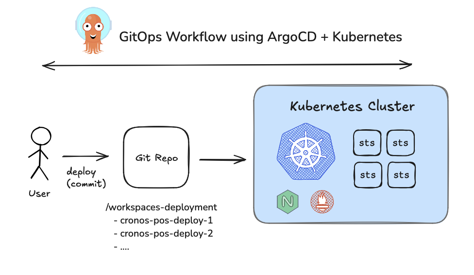

# crypto-com-devops-challenge

By: Heronimus Adie (adie@heronimus.id)

## Q1: Blockchain Installation Setup

### - Key Assumptions

The observer node implementation in my case will us a STATE-SYNC node configuration rather than a full validator node for the following reasons:
- Running a complete Full-Node requires significant computational resources
- STATE-SYNC provides near-the-head pruned data, which is sufficient for most API query needs

---

### - Tech-Stack Design Selection



The implementation follows a GitOps workflow pattern utilizing ArgoCD and Kubernetes:

- Users commit deployment changes to the Git repository
- Changes are organized in workspace deployments (e.g., cronos-pos-deploy-1, cronos-pos-deploy-2) in git repository
- ArgoCD automatically synchronizes these changes to the Kubernetes cluster


#### Kubernetes as Container Orchestrator
- Advantages:
  - Battle-tested platform with proven reliability in production
  - Support scalability for growing workloads
  - Cloud-agnostic architecture enabling multi-cloud and bare-metal deployments


#### GitOps Workflow with ArgoCD
- Advantages:
  - Declarative configuration management ensuring infrastructure as code
  - Automated synchronization between Git repository and cluster state
  - Clear audit trail and version control for all deployments
  - Simplified rollback capabilities through Git history
  - Enhanced collaboration through pull request workflows


#### Implementation Challenges
- Requires strong/comprehensive engineering expertise in Kubernetes architecture
- Initial setup complexity for proper proper maintainability and observability


---


### - Configuration/Deliverables

- `/cronos-pos-container`

  Contain the `Dockerfile` and scripts needed to launch Cronos-POS nodes in STATE-SYNC mode with configurable block heights (using CUSTOM_HEIGHT env var).
  There's two helper scripts:
  - `cronospos-init-mainnet.sh` --> Help init volume data and configuration with moniker-id, only run once on init container when node is starting from stract.
  - `cronospos-enable-statesync.sh` --> enable various configuration to app.toml & config.toml, mainly to setup the STATE-SYNC configuration.


- `/cronos-pos-k8s-template`:

  Stores Kubernetes deployment templates for Cronos-POS observer nodes, utilizing kustomize (https://kustomize.io/) for manifest management and patching.


- `/k8s-cluster-addons`:

  Provides supplementary configurations and add-ons for the Kubernetes environment including monitoring, ArgoCD, and ingress setup.

- `/workspace-gitops-deploy`:

  Derves as the GitOps deployment workspace containing individual Cronos-POS node configurations, with `example-cronos-pos-node-1` provided as a reference implementation.

- **Log file (Cronos-POS node)**

  Live log are available at https://grafana.cronos.heronimus.id/public-dashboards/b3b7220e5fa84b06b8a66ec716b3ef78?orgId=1


---


### - Testing and HandsOn


- **ArgoCD Dashboard** (Guest Access): https://argocd.cronos.heronimus.id/applications?namespace=cronos-pos


- **Cronos-POS** Synced-Node (Running on my local but proxied through my K8S cluster)
  - RPC: https://rpc-local-mac.cronos.heronimus.id/
  - Rest API: https://rest-local-mac.cronos.heronimus.id/
  - GRPC: grpc-local-mac.grpc-cronos.heronimus.id:443

- **Cronos-POS** Not-synced-Node (Running on my K8S cluster, but due to resource limitation, it can't sync to the latest block)
  - RPC: https://rpc-example-cronos-pos-node-1.cronos.heronimus.id/
  - Rest API: https://rest-example-cronos-pos-node-1.cronos.heronimus.id/
  - GRPC: grpc-example-cronos-pos-node-1.grpc-cronos.heronimus.id:443

- Node Log: https://grafana.cronos.heronimus.id/public-dashboards/b3b7220e5fa84b06b8a66ec716b3ef78?orgId=1


---

### - Questions

- What is the amount of balance address `cro1hsr2z6lr7k2szjktzjst46rr9cfavprqas20gc` has?

  Get Balance query can be done using a query to the Cosmos Bank Module using multiple endpoint available.

  - **Rest/Cosmos API (1317)**
  Query
  ```
  curl -X GET \
    https://rest-local-mac.cronos.heronimus.id/cosmos/bank/v1beta1/balances/cro1hsr2z6lr7k2szjktzjst46rr9cfavprqas20gc \
    -H 'Content-Type: application/json'
  ```
  Response: balance = 182513776 basecro
  ```
  {
    "balances": [
      {
        "denom": "basecro",
        "amount": "182513776"
      }
    ],
    "pagination": {
      "next_key": null,
      "total": "1"
    }
  }
  ```

  - **GRPC (9090)**
  Query
  ```
  grpcurl -plaintext \
      -d '{"address":"cro1hsr2z6lr7k2szjktzjst46rr9cfavprqas20gc"}' \
      localhost:9090 \
      cosmos.bank.v1beta1.Query/AllBalances
  ```
  Response
  ```
  {
    "balances": [
      {
        "denom": "basecro",
        "amount": "182513776"
      }
    ],
    "pagination": {
      "total": "1"
    }
  }
  ```

- What is the block hash for `13947398` information?

  Because I run the observer node using state-sync at higher trusted height so I can't query earlier block. I'll use the public RPC endpoint instead to get block hash for block `13947398`.

  Query
  ```
  curl -s "https://rpc.mainnet.cronos-pos.org:443/block?height=13947398" | jq -r .result.block_id.hash
  ```

  Response Block Hash
  ```
  6665D5883A7F029B37AE37D8ACDCC5B7BE6982018BB9280814A826CE2D494DDA
  ```


### - Challenges During the Setup and Operation

During the implementation phase, several significant technical hurdles were encountered:

- Resource Availability Constraints

  There's no light node type available, also the available QuickSync and PublicNode snapshots exceeded my personal hardware at homeand often got OOM on system with 32GB RAM.

- Network/RPC Reliability

  During the node setup with STATE-SYNC implementation I occasionally found that the default RPC endpoints got timeout issues ("context deadline exceeded"). I later added additional new public RPC as redudancy.

- Peer Connection Stability

  When operating in STATE-SYNC mode, the documentation recommends using persistent_peers rather than the regular peers configuration. However, the default three node peers provided in the documentation frequently disconnect unexpectedly, resulting in endless retry attempts since (probably) these peer slots are already at maximum capacity.
  Additionally, peer discovery often required extended periods (over 30 minutes) and would occasionally stall when searching for peers with compatible snapshots. By incorporating additional public seed peers from validators, we were able to significantly reduce the initialization time required to obtain the correct snapshot.


*Overall, setting up a blockchain system/node remains a challenging engineering task! :D*

----
## Q2: HTTP Server


### - Configuration/Deliverables

- `/web-server-proxy`: contains Nginx proxy configuration and Docker setup files for Blockchain RPC (Tendermint & Cosmos)

- `/web-server-proxy/access-log.log`: proxy access logs from benchmark testing, viewable at [https://grafana.cronos.heronimus.id/public-dashboards/e41fde8e52a34c0c96c6f139d1aa5323?orgId=1](https://grafana.cronos.heronimus.id/public-dashboards/e41fde8e52a34c0c96c6f139d1aa5323?orgId=1)

- How should we distribute these client certificates?

  Client certificates need a secure distribution via encrypted channels like:
  - Password-protected archives
  - Secret management or zero trust platforms/services
  - Automated certificate lifecycle systems (create, renew, revoke)
